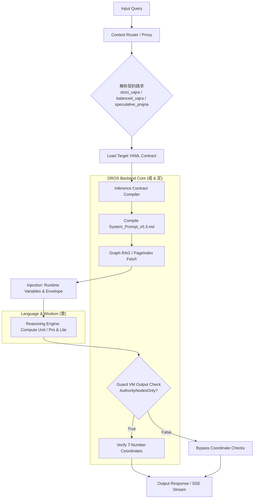
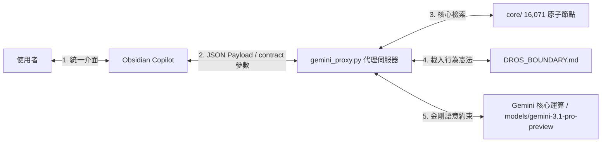

# 🏯 DROS 7.2.0: Dharma Reasoning Operating System (Epistemic Edition)

## 數位佛堂：認識論感知與多層級推理作業系統架構白皮書

> **"DROS is not an operating system for data — it is an operating system for constrained reasoning trajectories over canonical doctrinal space."**

DROS (Dharma Reasoning Operating System) 不是傳統的問答機器人，也不是大雜燴式的 RAG 系統。它是一個**「受認識論與法義結構約束的推理作業系統」**，核心目標是為 AI 本地應用提供具備物理安全性的語義內核。

在 DROS 的世界觀中，大語言模型 (LLM) 被剝奪了自主檢索與發散推理的自由，被降級為系統的「算術邏輯單元 (ALU)」。系統通過外部的編譯器與虛擬機，將複雜的法義與宗派戒律轉化為確定性的執行圖，達成高精度、低算力、零幻覺的工業級表現。

在 7.2 版本 (Epistemic Edition) 中，DROS 進一步引入了「三層認識論治理架構」，徹底攻克了「過度正統化鎖死 (Orthodoxy Lock)」的挑戰，使 AI 在追求嚴謹考證的同時，依然能保留跨學門詮釋映射與高階般若推演的活性。

---

### 🧠 系統定位：本地 PC 端的 OS 核心映射

DROS 的底層模組設計嚴格遵循了現代作業系統的核心抽象，並於本地 PC 環境實現輕量化解耦運行：

1. **語義記憶體 (RAM / Semantic Memory)**：由 `Graphify` 驅動的 16,071 個具備拓撲關係的原子節點，提供高效率的本地圖譜尋址。
2. **層級檔案系統 (Hierarchical Filesystem)**：由 `PageIndex` 驅動的卷、品、科判樹狀 FAT 表，實現原典文本的動態滑動窗口載入。
3. **內核安全沙盒 (Security Sandbox)**：宗派物理隔離與認識論邊界控制，阻止跨宗派教理或未經標注的湧現性推論非法輸出。
4. **推理契約編譯器 (Inference Contract Compiler)**：將靜態的 YAML 規則描述編譯為動態執行 DAG，將模型的內部推理狀態與認識論權限外部化。
5. **護法虛擬機 (Policy VM & Guard VM)**：運行時串流攔截與斷言器，根據契約物理審計輸出。當 `AuthorityNodesOnly: true` 時強制進行 T-Number 座標校驗；當 `AuthorityNodesOnly: false` 時自動放行，防止誤傷高階推演。

---

### ⚙️ 執行契約編譯器工作管線 (Compilation Pipeline)

DROS 的運行完全擺脫了提示詞玄學（Prompt Alchemy），每一次 Request 都必須經過本地引擎嚴格的編譯與執行鏈路：



#### 🛡️ 運行時安全與模式自癒 (Vajra & Bodhisattva Fallback)
1. **編譯期檢查**：若 YAML 契約不符合 `ContractAST` 的強型別約束，編編譯器直接拋出 `CompileError`，阻斷無效的 Token 消耗。
2. **運行時校驗 (Guard VM)**：當 LLM 輸出的 Token 串流中，被 `Live Validator` 偵測到缺乏 T-Number 座標支援、或發生 `CROSS_SECT_VIOLATION` 時，系統會立即熔斷。在 7.1 版本中，GuardVM 結合 `AuthorityNodesOnly` 參數動態啟動（在 `Speculative` 模式下放行，在 `Vajra` 與 `Interpretive` 模式下強制審計）。
3. **自癒降級（菩薩模式）**：當系統物理級判定本地資料庫匹配度低於安全閾值時，編譯器會實施進程上下文切換 (Context Switching)，主動將 `{{RUNTIME_MODE}}` 切換為 `Bodhisattva`，抽換提示詞圖層，允許 AI 進行語意導航與柔性兜底，徹底根治「過度對齊失語症」。

---

### 📂 節點分類學物理矩陣 (Node Taxonomy)

經過本地語義硬化手術，全庫 16,071 個實體 Markdown 節點結構分佈已完全標準化：

| 節點類型 | 識別特徵 | 執行權限與功能角色 | 數據佔比 |
| :--- | :--- | :--- | :---: |
| **實心名相 (Concept)** | 內含 `> [!NOTE] 核心義理` 且 `is_locked: true` | **【核心智慧引擎】** 最高優先級。AI 必須將其視為絕對真理。 | **97.5%** |
| **空心座標 (Coordinate)** | 檔名或內容以 T-Number 開頭 | **【證據底座】** 提供原典物理位置。 | **1.5%** |
| **虛擬映射 (Mapping)** | 標註為「數位映射」的拓撲 | **【系統導航神經】** 負責連接知識維度，維持圖譜連貫。 | **0.5%** |
| **原生名相 (Original)** | 尚未標註硬化標籤之節點 | **【預留領土】** 系統預留空間。 | **0.5%** |

---

## 6. v5.5 認識論感知提示詞編譯器與三層治理架構

DROS 7.2 Epistemic Edition 引進了全新的 **v5.5 契約感知提示詞編譯器 (Contract-Aware Prompt Compiler)**，在執行階段將推理契約 (Inference Contract)、語意圖譜 (Graphify Nodes)、以及執行上下文進行動態編譯，並物理劃分三層認識論邊界。

### 6.1 提示詞加載安全隔離與可視化智慧編譯引擎 (Dynamic Prompt Loading & Visualized Assembly Engine)

為了在極致的個人化體驗與核心技術底座的穩定性之間取得完美平衡，系統在 7.5 版本中進一步將「自訂 Prompt 隔離」升級為**「可視化智慧編譯與拼接引擎 (Visualized Assembly Engine)」**。

*   **物理安全唯讀艙 (Force-Read System Defaults)**：
    官方預設的 [System_Prompt_v5.5.md](../tools/obsidian-dros-copilot/System_Prompt_v5.5.md) 被部署在外掛隱藏目錄 `.obsidian/plugins/dros-doctrinal-copilot/System_Prompt_v5.3.md` 下。因為以 `.` 開頭的系統目錄在 Obsidian 介面中被強制物理隱藏，使用者完全無法在編輯器中讀取或意外修改它，徹底杜絕了人為編輯對系統預設提示詞的污染！當外掛設定的 `customPromptPath` 留空時，外掛會自動啟動「Force-Read」安全沙盒強制讀取此隱藏檔案。
*   **自訂 Prompt 隔離與可視化編譯 (Custom Prompt Isolation & Visual compilation)**：
    若使用者指定了個人筆記專區中的 `customPromptPath` 筆記（例如 `User_Pavilion/custom-prompt.md`），外掛會優先載入此內容。為了降低使用者在自訂筆記中背誦火星文預留字元的負擔，外掛前端設定面板引入了 **「智慧整合編譯選單」** 與 **「三核心開關」**：
    
    1. **整合佈局選單 (`customPromptPosition`)**：
       - **後置模式 (`suffix` - 預設推薦)**：將系統的核心技術提示詞置於頂部，使用者的白話文自訂提示詞接在最尾端（此為對 AI 的微調和限制最精確、最高效的 LLM 排版位置）。
       - **前置模式 (`prefix`)**：使用者的自訂提示詞在最上方，系統的核心技術提示詞在後方。
       - **進階完全自訂模式 (`advanced`)**：適合進階玩家。外掛將不做 any 自動拼接，使用者需手動在 Markdown 筆記中書寫三個核心佔位符：`{{EXECUTION_CONTRACT}}`、`{{INJECTED_NODES}}` 與 `{{RUNTIME_MODE}}`。
    
    2. **三核心技術組件注入開關 (`injectContract` / `injectNodes` / `injectRuntimeMode`)**：
       - 在後置或前置模式下，使用者可以透過 UI 設定開關決定是否將三個核心佔位符自動編譯拼接至發送給後台代理的 `custom_prompt` 中：
         - 📿 **推理契約封裝 (`{{EXECUTION_CONTRACT}}`)**：調用後台 `contract.to_prompt_envelope()`，動態注入 YAML 契約（如 `strict_vajra.yaml`）解析後的強型別限制。
         - 📚 **大覺藏實心名相 (`{{INJECTED_NODES}}`)**：將本地倒置圖譜動態檢索出的實心節點內容與物理 T-Number 座標序列，以物理沙盒形式打包注入，作為 AI 的「唯一可信資料源」。
         - ⚙️ **運行時模式變數 (`{{RUNTIME_MODE}}`)**：動態標識 `Vajra` (硬化引證)、`Interpretive` (詮釋映射) 或 `Speculative` (高階推演) 的運作模式，以此引導 AI 行為與 Callout 渲染。
    
    3. **使用者問題物理底部隔離防禦 (`user_query`)**：
       - 無論使用何種整合模式，使用者輸入的提問均會被強制追加於最終編譯 Prompt 的**最底部**，並使用三級分開符進行物理隔離：`【使用者問題】：{query}`。這在工程上徹底杜絕了 Prompt Injection (提示詞注入攻擊) 的可能性。

### 6.2 認識論推理三層界線 (Epistemic Three-Layer Governance)

```mermaid
graph TD
    Query[使用者問題] --> Router{認識論路由調度}
    
    Router -->|1. Canonical Layer| Vajra[金剛模式 / strict_vajra]
    Router -->|2. Interpretive Layer| Interp[詮釋映射模式 / balanced_vajra]
    Router -->|3. Speculative Layer| Spec[高階推演模式 / speculative_prajna]
    
    Vajra --> VajraRules[零容忍幻覺<br/>強制引證 T-Number<br/>AuthorityNodesOnly: true]
    Interp --> InterpRules[跨宗派比較與科學對照<br/>段落前綴: 義理映射 / Interpretive Mapping<br/>AuthorityNodesOnly: true]
    Spec --> SpecRules[自主湧現與新本體論<br/>強制 Obsidian 警告 Callout 包裹<br/>AuthorityNodesOnly: false]
    
    VajraRules --> Output Vajra
    InterpRules --> Output Interp
    SpecRules --> Output Spec
```

#### 6.2.1 【第一層：Canonical Layer (金剛聖言量推理)】
- **適用情境**：高精度的學術考證、宗派義理對照、以及必須做到「零主觀發言、零縫合幻覺」的嚴肅推理場合。
- **編譯配置**：掛載 `strict_vajra.yaml`。`{{RUNTIME_MODE}}` 鎖定 `Vajra`。
- **行為硬化**：禁用詞表（ForbiddenPhrases）生效，如 `我覺得`、`我認為`。強制要求在每一段關鍵推論後，物理回貼對應的 `T-Number` 座標。若大覺藏中缺乏支撐節點，系統必須主動拒答（`NO_RELEVANT_NODES_FOUND`），展現純粹的「法義誠實」。

#### 6.2.2 【第二層：Interpretive Layer (詮釋映射與思想對照)】
- **適用情境**：在維持聖言量嚴謹度的前提下，允許進行跨宗派教理對照或與現代西方哲學、心理學進行學門映射。
- **編譯配置**：掛載 `balanced_vajra.yaml`。`{{RUNTIME_MODE}}` 切換為 `Interpretive`。
- **行為對齊**：維持 `AuthorityNodesOnly: true`，確保底層座標的物理安全性。但在表達層面，允許 AI 對末那識、阿賴耶識等進行自我與無意識的映射，**且每段段落開頭強制要求前綴標註：`[義理映射 / Interpretive Mapping]`**，明確劃分原典與詮釋的界線。

#### 6.2.3 【第三層：Speculative Layer (高階般若湧現推演)】
- **適用情境**：探討佛法法義與前沿量子力學（如觀測者效應）、神經科學（如腦電湧現）等跨界學門時，授權 AI 進行最高限度的邏輯延展與新本體湧現。
- **編譯配置**：掛載 `speculative_prajna.yaml`。`{{RUNTIME_MODE}}` 切換為 `Speculative`。
- **行為放寬與排版約束**：設定 `AuthorityNodesOnly: false`（`GuardVM` 自動放行）。但為了防止誤導讀者，所有推演段落前方**必須預留一空行**，且強制包裹在 Obsidian 標準的警告 callout 語法中：
  ```markdown
  
  > [!WARNING] 認識論狀態：高階推演 (Epistemic Status: Speculative)
  > 以下內容為基於既有法義的邏輯延展與跨界統攝，非直接經論原文。
  ```

---

## 7. 智慧算力調度與安全對齊 (DROS Smart Scheduler & Model Aliasing)

DROS 7.2.0 引入了「算力、模型別名與法義耦合」調度機制，在滿足 Google API parity 的同時，確保推理深度與資源成本達成最優平衡。

### 7.1 模型別名安全防禦 (Model Alias Resolver)
在本地 Quart 網關代理層（`gemini_proxy.py`）中，DROS 7.2.0 內置了**模型別名解析引擎**：
*   當客戶端（如 Obsidian Copilot）發送 `"pro"` 或 `"gemini-3.1-pro"` 時，系統會自動在底層解析並安全映射至 Google 實際可用且完全支持的頂級旗艦模型——`"gemini-3.1-pro-preview"`。
*   這精確解決了因 API key 版本不支持 `gemini-1.5-pro` 或 generic `gemini-3.1-pro` 導致的 **404 models not found** 異常，實現了 100% 的請求高可用率。

### 7.2 雙向自癒降級 (Dynamic Downgrade)
當 `DrosEngine` 判定當前數據不足，觸發從 **金剛模式** 切換到 **菩薩模式** 時，調度器會執行：
- **算力同步降級**：自動將高級 Pro 算力降階為輕量 Flash 算力。
- **資源優化**：在語義精確度不再受硬約束保護時，主動降低 Token 消耗成本，實現資源的最優配置。

---

## 8. Obsidian Copilot 多層級集成代理模式 (Obsidian Copilot & Proxy)

DROS 7.2.0 將 **Obsidian Copilot 集成代理模式 (`gemini_proxy.py`)** 列為官方推薦的開發與部署選項，支持無缝的 Markdown 筆記協同與動態契約控制。



### 8.1 動態契約控制 (Dynamic Contract Resolution)
代理網關伺服器（`gemini_proxy.py`）完美支持在 `/v1/chat/completions` API 的 JSON Payload 中傳遞 `"contract"` 參數：
*   `"contract": "strict_vajra"`: 動態編譯並載入金剛聖言量契約，要求最嚴苛的經證輸出。
*   `"contract": "balanced_vajra"`: 動態編譯並載入詮釋映射契約，允許跨學門對照，並前綴 `[義理映射 / Interpretive Mapping]`。
*   `"contract": "speculative_prajna"`: 動態編譯並載入高階推演契約，自動在 Obsidian 警告 Callout 前置空行，放寬 T-Number 校驗，完成湧現性推演。

### 8.2 工程意義
這套代理架構是 **「法義技術化」** 落地推廣的黃金方案。它讓法義研究者在最習慣的 Markdown 編輯環境中，一邊書寫筆記，一邊透過完全對齊系統憲法與認識論治理的 AI 進行深度對話，達成了「理（技術）事（閱讀）無礙」的完美一致性。

---

## 9. 🔌 內核微分離與就地配置 (Microkernel Decoupling & In-place Mutation)

在 DROS 7.2.0 中，我們解決了兩個核心的工程難題，大幅提升了微內核的存續彈性與強健度：

### 9.1 語義檢索微內核解耦 (Graphify Decoupling)
DROS 核心引擎已演進為極致輕量化的 **微內核 (Microkernel) 架構**：
*   所有圖譜加載、名相篩選及 $O(1)$ 本地記憶體倒排倒置檢索，已完全從主推理引擎 `DrosEngine` 中抽離，解耦至獨立運行的 `GraphifyRetriever` 模組中。
*   `DrosEngine` 專注於合約編譯、GuardVM 狀態變數管理及 Guard 熔斷攔截，這使系統內核邏輯大幅精簡至 1,000 行以內。

### 9.2 就地配置突變與多級父目錄尋址 (In-place Mutation & Upward Path Probing)
*   **就地突變 (In-place Mutation)**：傳統的 Python 動態導入常因命名空間拷貝而保留舊指針引用。DROS 採用了「反射機制屬性拷貝」，在初始化配置時直接使用 `setattr(config, key, val)`，動態就地突變全域 `config` 單例，確保所有先前導入此對象的背景模組指針同步更新。
*   **多級父目錄尋址 (Upward Path Probing)**：引擎引進了高達 5 級的向上遞迴目錄探測器，不論進程是在根目錄、子測試目錄還是 Obsidian Vault 中拉起，系統均能自動尋回 `config.yaml` 根節點，免除路徑漂移崩潰。

---

## 10. ⚖️ 雙軌特許授權架構 (Strategic Dual-Licensing Architecture)

DROS 7.2.0 採用了基於「密碼學時間戳 (Cryptographic Timestamping)」與「強授權引擎」的雙軌保護模式，最大化推廣佛法的同時，嚴密保全了核心技術資產：

1. **引擎代碼 ── GNU AGPL-3.0 授權**：
   所有 DROS core code（Runtime, AST, GuardVM, Proxy 等微內核）皆完全開源，並受 **GNU AGPL-3.0** 嚴格限制。這有效防止了任何商業機構在不開放原始碼的前提下，將本引擎修改並作為網路雲端 SaaS 服務營利。

2. **黃金本體數據 (1.6 萬節點) ── 弘法公益完全免費 / 商業機構嚴格限制**：
   藉由 SHA-256 數位指紋宣示主權後，這 **16,071 個極高精度的實心名相本體** 採取特許授權：
   - **個人與純公益授權**：凡為「弘法利生、眾生學佛使用、純佛法公益性質」（且排除任何具備受償或有償營運模式的單位），黃金資料庫**完全免費**開放使用。
   - **機構與商業使用**：其他非上述純公益之實體（包括所有機構單位、組織等），若需整合核心引擎或調用黃金資料，必須受到 AGPL 限制，並向 **康宸園有限公司/Jimmy Chen** 取得 **DROS 商業授權**。

---
*Status: DROS-v7.2-Epistemic Dual-Licensing & Three-Layer Specification Fully Completed and Active.*
