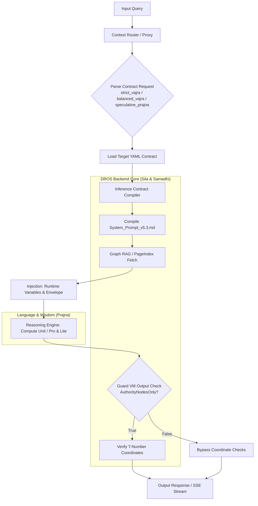
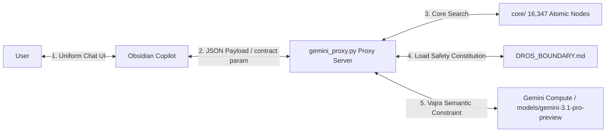

# 🏯 DROS 7.3: Dharma Reasoning Operating System (Epistemic Edition)

## Digital Temple: Epistemic & Multi-Layered Reasoning Operating System Architecture Whitepaper

[繁體中文](ARCHITECTURE_v7_zh.md) | [English](ARCHITECTURE_v7.md)

> **"DROS is not an operating system for data — it is an operating system for constrained reasoning trajectories over canonical doctrinal space."**

DROS (Dharma Reasoning Operating System) is not a traditional chatbot or a bloated generic RAG system. It is a **"Reasoning Operating System Constrained by Epistemology and Doctrinal Structure,"** whose core objective is to provide a physically secure semantic kernel for local AI applications.

In the world view of DROS, Large Language Models (LLMs) are stripped of their freedom of autonomous retrieval and divergent reasoning, being demoted to the system's "Arithmetic Logic Unit (ALU)." The system translates complex doctrines and sectarian precepts into deterministic execution graphs through external compilers and virtual machines, achieving high-precision, low-compute, and zero-hallucination industrial performance.

In version 7.3 (Epistemic Edition), DROS further introduces a "Three-Layer Epistemic Governance Architecture," completely overcoming the challenge of "Orthodoxy Lock" and preserving the vitality of cross-disciplinary interpretation and high-level Prajna speculation while maintaining rigorous text verification.

---

### 🧠 System Positioning: OS Core Mapping on Local PC

The low-level design of DROS strictly follows the abstractions of modern operating system kernels, implemented in a lightweight decoupled runtime on local PCs:

1. **Semantic Memory (RAM)**: Driven by `Graphify`, it manages 16,347 atomic nodes with topological relations, providing high-efficiency local graph routing.
2. **Hierarchical Filesystem**: Driven by `PageIndex`, it maps volumes, chapters, and outline trees into a FAT-like index to stream canonical texts dynamically via sliding windows.
3. **Kernel Security Sandbox**: Sectarian physical path isolation and epistemic boundary controls block cross-sectarian concepts or unlabeled emergent reasoning from illegal output.
4. **Inference Contract Compiler**: Compiles static YAML contract specifications into dynamic execution DAGs, externalizing the LLM's internal reasoning state and epistemic permissions.
5. **Guardian Virtual Machines (Policy VM & Guard VM)**: Runtime stream interceptors and assertion checkers. When `AuthorityNodesOnly: true`, strict T-Number coordinate validation is enforced; when `AuthorityNodesOnly: false`, coordinates are bypassed to prevent blocking high-level reasoning.

---

### ⚙️ Inference Contract Compiler Pipeline

The execution of DROS completely departs from "Prompt Alchemy"; every request must pass through a strict compilation and execution path on the local engine:


```mermaid
graph TD
    A[Input Query] --> B[Context Router / Proxy]
    B --> C{Parse Contract Request<br/>strict_vajra / balanced_vajra / speculative_prajna}
    C --> D[Load Target YAML Contract]
    D --> E[Inference Contract Compiler]
    E --> F[Compile System_Prompt_v5.3.md]
    F --> G[Graph RAG / PageIndex Fetch]
    G --> H[Injection: Runtime Variables & Envelope]
    H --> I[Reasoning Engine: Compute Unit / Pro & Lite]
    I --> J{Guard VM Output Check<br/>AuthorityNodesOnly?}
    J -- True --> K[Verify T-Number Coordinates]
    J -- False --> L[Bypass Coordinate Checks]
    K --> M[Output Response / SSE Stream]
    L --> M
    
    subgraph "DROS Backend Core (Sila & Samadhi)"
    E
    F
    G
    J
    K
    end
    
    subgraph "Language & Wisdom (Prajna)"
    I
    end
```

#### 🛡️ Runtime Safety & Self-Healing (Vajra & Bodhisattva Fallback)
1. **Compile-time Checking**: If the YAML contract violates the strong type constraints of the `ContractAST`, the compiler throws a `CompileError` immediately, preventing wasted tokens.
2. **Runtime Verification (Guard VM)**: When the `Live Validator` detects that the LLM's output token stream lacks T-Number coordinate backup or causes a `CROSS_SECT_VIOLATION`, the system immediately blows the fuse. In v7.3, GuardVM is dynamically activated depending on `AuthorityNodesOnly` (bypassed in `Speculative` mode, audited in `Vajra` and `Interpretive` modes).
3. **Self-Healing Fallback (Bodhisattva Mode)**: When the system physically determines that the local database match rate is below the safety threshold, the compiler triggers a context switch, modifying `{{RUNTIME_MODE}}` to `Bodhisattva` and swapping prompt layers. This allows the AI to provide semantic guidance and a soft fallback, curing "over-alignment aphasia."

---

### 📂 Node Taxonomy Physical Matrix

Through semantic hardening, all 16,347 physical Markdown nodes in the database are standardized:

| Node Type | Distinguishing Features | Execution Permissions & Role | Data Ratio |
| :--- | :--- | :--- | :---: |
| **Concept** | Contains `> [!NOTE] Doctrinal Essence` & `is_locked: true` | **[Core Wisdom Engine]** Highest priority. AI must treat this as absolute truth. | **97.5%** |
| **Coordinate** | Filename or content starts with T-Number | **[Evidence Base]** Provides physical location of original texts. | **1.5%** |
| **Mapping** | Labeled as "Digital Mapping" topology | **[System Navigation Synapse]** Connects knowledge dimensions to maintain graph coherence. | **0.5%** |
| **Original** | Nodes without hardening labels | **[Reserved Territory]** Reserved space for future expansion. | **0.5%** |

---

## 6. v5.3 Contract-Aware Prompt Compiler & Three-Layer Governance

DROS v7.3 Epistemic Edition introduces the **v5.3 Contract-Aware Prompt Compiler**, which dynamically compiles the Inference Contract, Graphify Nodes, and execution context at runtime, physically dividing three layers of epistemic boundaries.

### 6.1 Dynamic Prompt Loading & Visualized Assembly Engine

To achieve the perfect balance between extreme personalization and the stability of the core technology substrate, the system upgrades "custom prompt isolation" to a **"Visualized Assembly Engine."**

*   **Force-Read System Defaults (Read-Only Safety Cabin)**:
    The default [System_Prompt_v5.3.md](../tools/obsidian-dros-copilot/System_Prompt_v5.3.md) is deployed under the hidden directory `.obsidian/plugins/dros-doctrinal-copilot/System_Prompt_v5.3.md`. Since dotfiles are physically hidden in the Obsidian UI, users cannot read or modify them accidentally, preventing contamination of default prompts! When `customPromptPath` is empty, the plugin automatically falls back to the read-only sandbox.
*   **Custom Prompt Isolation & Visual Compilation**:
    If a user designates a custom prompt file (e.g., `User_Pavilion/custom-prompt.md`), the plugin will prioritize it. To relieve users from memorizing wildcard placeholders, the settings panel introduces **"Smart Integration Assembly Options"** and **"Three Core Switches"**:
    
    1. **Assembly Position (`customPromptPosition`)**:
       - **Suffix Mode (`suffix` - Default Recommended)**: Places core technical prompts at the top, and user custom prompts at the very end (the most precise layout for guiding the LLM).
       - **Prefix Mode (`prefix`)**: Places user prompts at the top, and core prompts at the back.
       - **Advanced Mode (`advanced`)**: The plugin does no automatic stitching; users must manually insert three placeholders: `{{EXECUTION_CONTRACT}}`, `{{INJECTED_NODES}}`, and `{{RUNTIME_MODE}}`.
    
    2. **Component Switches (`injectContract` / `injectNodes` / `injectRuntimeMode`)**:
       - Under Prefix/Suffix mode, users can toggle switches via the UI to inject components:
         - **`{{EXECUTION_CONTRACT}}`**: Resolves the YAML contract (e.g. `strict_vajra.yaml`) into strong-typed prompts via `contract.to_prompt_envelope()`.
         - **`{{INJECTED_NODES}}`**: Packs and injects the retrieved concept contents and T-Number coordinates as the AI's "Only Source of Truth."
         - **`{{RUNTIME_MODE}}`**: Toggles `Vajra` (Hardened Citation), `Interpretive` (Mapping), or `Speculative` (Emergent Speculation) runtime modes.
    
    3. **User Query Isolation (`user_query`)**:
       - Regardless of the integration mode, the user query is appended to the **very bottom** of the compiled prompt, isolated by a distinct marker: `【User Query】: {query}`. This prevents prompt injection attacks.

### 6.2 Epistemic Three-Layer Governance

```mermaid
graph TD
    Query[User Query] --> Router{Epistemic Router}
    
    Router -->|1. Canonical Layer| Vajra[Vajra Mode / strict_vajra]
    Router -->|2. Interpretive Layer| Interp[Interpretive Mode / balanced_vajra]
    Router -->|3. Speculative Layer| Spec[Speculative Mode / speculative_prajna]
    
    Vajra --> VajraRules[Zero-Tolerance for Hallucinations<br/>Enforced T-Number Citation<br/>AuthorityNodesOnly: true]
    Interp --> InterpRules[Cross-Sectarian Comparison<br/>Prefix: Interpretive Mapping<br/>AuthorityNodesOnly: true]
    Spec --> SpecRules[Emergent Reasoning & New Ontologies<br/>Obsidian Warning Callout Wrapper<br/>AuthorityNodesOnly: false]
    
    VajraRules --> Output Vajra
    InterpRules --> Output Interp
    SpecRules --> Output Spec
```

#### 6.2.1 【Layer 1: Canonical Layer (Vajra Holy Cognition Reasoning)】
- **Use Case**: High-precision academic textual research, sectarian doctrinal comparison, and strict reasoning scenes requiring zero subjective voice.
- **Compilation Config**: Mounts `strict_vajra.yaml`. `{{RUNTIME_MODE}}` is locked to `Vajra`.
- **Behavior Hardening**: Forbidden phrases (e.g., "I think," "in my opinion") are active. Every key inference must end with its physical `T-Number` coordinate. If the vault lacks support nodes, the system must refuse to answer (`NO_RELEVANT_NODES_FOUND`), demonstrating absolute "doctrinal honesty."

#### 6.2.2 【Layer 2: Interpretive Layer (Interpretation & Comparative Doctrinal Mapping)】
- **Use Case**: Allows cross-sectarian doctrinal mapping or comparative analysis with Western philosophy/psychology under strict textual bounds.
- **Compilation Config**: Mounts `balanced_vajra.yaml`. `{{RUNTIME_MODE}}` switches to `Interpretive`.
- **Behavior Alignment**: Keeps `AuthorityNodesOnly: true` for physical security of coordinates. However, in expression, AI is allowed to map concepts like Manas or Alayavijnana to the ego or the unconscious. **Each paragraph must start with the prefix: `[Interpretive Mapping]`** to clearly demarcate canon from interpretation.

#### 6.2.3 【Layer 3: Speculative Layer (High-Level Prajna Speculative Speculation)】
- **Use Case**: Exploring quantum mechanics (e.g. observer effect) or neuroscience (e.g. emergent consciousness) with Buddhism, authorizing AI to extend logic and form new ontologies.
- **Compilation Config**: Mounts `speculative_prajna.yaml`. `{{RUNTIME_MODE}}` switches to `Speculative`.
- **Behavior & Layout Constraints**: Sets `AuthorityNodesOnly: false` (GuardVM bypass). However, to prevent misleading readers, all speculative paragraphs **must follow a blank line** and be wrapped in an Obsidian warning callout block:
  ```markdown
  
  > [!WARNING] Epistemic Status: Speculative
  > The following content is a logical extension and cross-disciplinary synthesis based on existing doctrine, not the original scriptural text.
  ```

---

## 7. Smart Scheduler & Model Aliasing

DROS 7.3 introduces a scheduling mechanism coupling computation, model aliases, and doctrinal strictness to balance reasoning depth and token costs.

### 7.1 Model Alias Resolver
In the local Quart proxy gateway (`gemini_proxy.py`), DROS 7.3 integrates a **Model Alias Engine**:
*   When a client requests `"pro"` or `"gemini-3.1-pro"`, the system automatically maps the request to Google's actual supported flagship model: `"gemini-3.1-pro-preview"`.
*   This resolves the **404 models not found** exceptions caused by key subscription mismatches, ensuring 100% request availability.

### 7.2 Dynamic Downgrade
When `DrosEngine` triggers a fallback from **Vajra Mode** to **Bodhisattva Mode**, the scheduler:
- **Downgrades Computation**: Automatically routes requests from the Pro engine to the lightweight Flash engine.
- **Optimizes Resources**: Lowers token consumption costs when semantic precision is no longer strictly bound, optimizing resource allocation.

---

## 8. Obsidian Copilot Proxy Mode

DROS v7.3 positions the **Obsidian Copilot Integration Proxy Mode (`gemini_proxy.py`)** as the official recommended deployment, supporting seamless Markdown notes synchronization and dynamic contract control.


```mermaid
graph LR
    User[User] <-->|1. Uniform Chat UI| Obsidian[Obsidian Copilot]
    Obsidian <-->|2. JSON Payload / contract param| Proxy[gemini_proxy.py Proxy Server]
    Proxy <-->|3. Core Search| Core[core/ 16,347 Atomic Nodes]
    Proxy <-->|4. Load Safety Constitution| Boundary[DROS_BOUNDARY.md]
    Proxy <-->|5. Vajra Semantic Constraint| LLM[Gemini Compute / models/gemini-3.1-pro-preview]
```

### 8.1 Dynamic Contract Resolution
The proxy gateway server (`gemini_proxy.py`) supports passing the `"contract"` parameter in API requests:
*   `"contract": "strict_vajra"`: Compiles the Vajra contract, demanding the most rigorous scripture citations.
*   `"contract": "balanced_vajra"`: Compiles the Interpretive contract, allowing comparative mapping prefixed with `[Interpretive Mapping]`.
*   `"contract": "speculative_prajna"`: Compiles the Speculative contract, automatically injecting callouts and bypassing coordinate checks for emergent speculation.

---

## 9. Microkernel Decoupling & In-place Mutation

DROS v7.3 resolves two major software engineering hurdles to enhance kernel robustness:

### 9.1 Graphify Decoupling
The core engine has evolved into a **Microkernel Architecture**:
*   All graph loading, concept filtering, and $O(1)$ in-memory inverted index searching are extracted into the independent `GraphifyRetriever` module.
*   `DrosEngine` focuses entirely on contract compilation, GuardVM state variable tracking, and fuse checking, simplifying the kernel codebase to under 1,000 lines.

### 9.2 In-place Configuration Mutation & Upward Path Probing
*   **In-place Mutation**: Traditional Python module reloads create namespace copies that break existing references. DROS utilizes reflection-based attribute copying via `setattr(config, key, val)` to mutate the global config singleton in-place, syncing all background module references instantly.
*   **Upward Path Probing**: The engine features a recursive parent directory probing pathfinder (up to 5 levels) to automatically locate `config.yaml` whether initialized from the root directory, test suites, or nested Obsidian vaults.

---

## 10. Strategic Dual-Licensing Architecture

DROS v7.3 employs a dual-licensing strategy to maximize ecosystem adoption while securing core proprietary data assets:

1.  **Engine Code ── GNU AGPL-3.0**: All core codebase components (Runtime, AST, GuardVM, Graphify, Proxy) are open-source under the **AGPL-3.0** copyleft license. This prevents institutions from modifying the engine for private cloud SaaS services without giving back to the community.
2.  **Community Dataset ── CC BY-NC-SA 4.0**: Provides 500 basic concept nodes and schemas for testing and verification.
3.  **Golden Doctrinal Dataset ── Proprietary (All Rights Reserved)**: The high-precision dataset containing **16,347 nodes** is protected as proprietary data. Any commercial use or closed-source integration of these semantic nodes requires a commercial license from **Top Celestial Company Ltd. / Jimmy Chen**.

---
*Status: DROS-v7.3-Epistemic Dual-Licensing & Three-Layer Specification Fully Completed and Active.*
